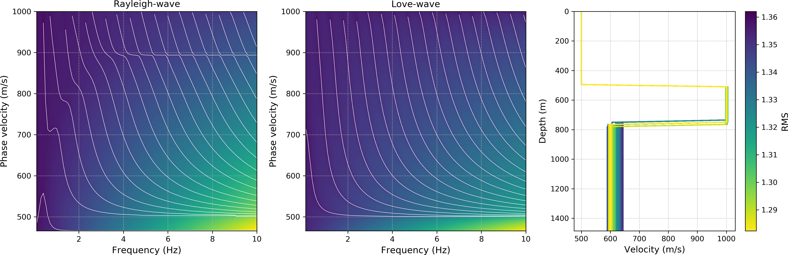

********
EvoDCinv
********

EvoDCinv is a Python package that provides functions to calculate and invert
dispersion curves using different evolutionary algorithms.

:Version: 1.0.0
:Author: Keurfon Luu
:Web site: https://github.com/keurfonluu/evodcinv
:Copyright: This document has been placed in the public domain.
:License: EvoDCinv is released under the MIT License.

**NOTE**: EvoDCinv has been implemented in the frame of my Ph. D. thesis. If you find any error or bug, or if you have any suggestion, please don't hesitate to contact me.

Installation
============

The recommended way to install EvoDCinv is through pip (internet required):

.. code-block:: bash

    pip install evodcinv

Otherwise, download and extract the package, then run:

.. code-block:: bash

    python setup.py install

Troubleshooting on Windows
==========================

A Fortran compiler is required to install this package. While it is
straightforward on Unix systems, it can be quite a pain on Windows. We recommend
installing `Anaconda <https://www.continuum.io/downloads>`__ that contains all
the required packages to install FTeikPy on Windows systems.

1. Download `MinGW 64 bits <https://sourceforge.net/projects/mingw-w64/files/>`__
   (choose *x86_64-posix-sjlj*) and extract the archive in your drive root.

2. Add MinGW to your system path:

    C:\\<Your MinGW directory>\\bin

3. Create the file *distutils.cfg* in *<Your Python directory path>\\Lib\\distutils*
   with the following content to use MinGW compiler:

.. code-block::

    [build]
    compiler=mingw32

4. Open a terminal and install *libpython*:

.. code-block:: batch

    conda install libpython

If you got the error:

    Error: ValueError: Unknown MS Compiler version 1900

You may need to manually patch the file *cygwinccompiler.py* located in:

    <Your Python directory path>\\Lib\\distutils

by replacing:

.. code-block:: python

    self.dll_libraries = get_msvcr()

in lines 157 and 318 by (be careful with indentation):

.. code-block:: python

    pass

You should also patch the file *mingw32ccompiler.py* located in:

    <Your Python directory path>\\Lib\\site-packages\\numpy\\distutils

by commenting out from lines 96 to 104:

.. code-block:: python

    #        msvcr_success = build_msvcr_library()
    #        msvcr_dbg_success = build_msvcr_library(debug=True)
    #        if msvcr_success or msvcr_dbg_success:
    #            # add preprocessor statement for using customized msvcr lib
    #            self.define_macro('NPY_MINGW_USE_CUSTOM_MSVCR')
    #
    #        # Define the MSVC version as hint for MinGW
    #        msvcr_version = '0x%03i0' % int(msvc_runtime_library().lstrip('msvcr'))
    #        self.define_macro('__MSVCRT_VERSION__', msvcr_version)
    
    
Related works
=============

* `StochOPy <https://github.com/keurfonluu/stochopy>`__: StochOPy (STOCHastic OPtimization for PYthon) provides user-friendly routines to sample or optimize objective functions with the most popular algorithms.